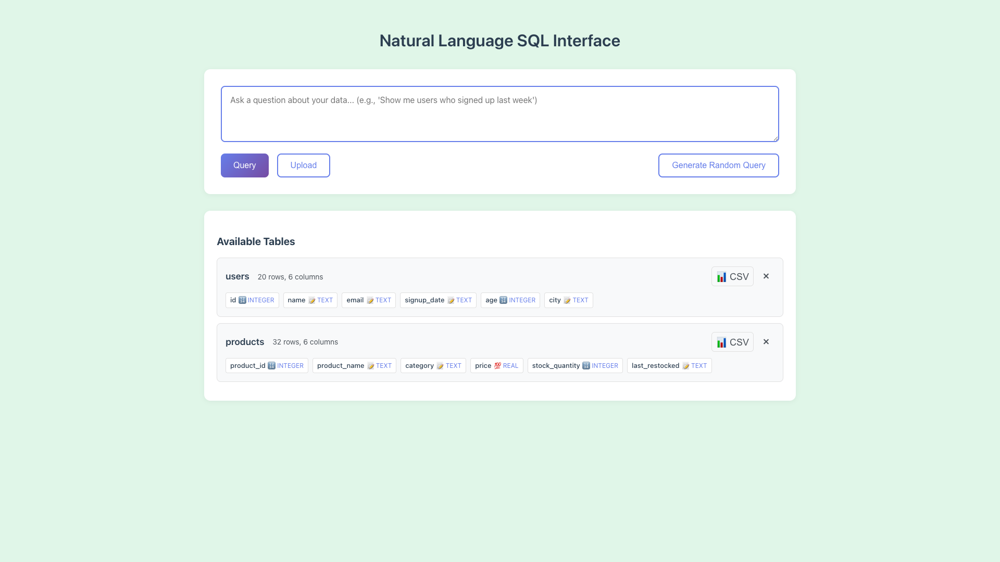

# Light Green Background Color Update

**ADW ID:** 1036a348
**Date:** 2026-01-12
**Specification:** specs/issue-2-adw-1036a348-sdlc_planner-light-green-background.md

## Overview

Updated the application's background color from light sky blue (#E0F6FF) to light green (#E0F6E8). This change provides a fresh, calm appearance while maintaining the same tone and brightness level. The implementation uses the existing CSS variable system, ensuring consistent application across all UI components.

## Screenshots




## What Was Built

- Updated CSS variable `--background` to light green color (#E0F6E8)
- Background color now displays consistently across all application pages
- Visual refresh maintains existing readability and contrast ratios

## Technical Implementation

### Files Modified

- `app/client/src/style.css`: Changed `--background` CSS variable from `#E0F6FF` (light sky blue) to `#E0F6E8` (light mint green)

### Key Changes

- Single line change in the CSS variables section (line 9)
- The `--background` variable is used by the `body` selector, ensuring the new color applies globally
- Color choice (#E0F6E8) matches the tone and brightness of the previous light sky blue
- Maintains good contrast with existing text colors (`--text-primary: #2c3e50` and `--text-secondary: #495057`)

## How to Use

The background color change is automatically applied throughout the application:

1. Navigate to any page in the application
2. The light green background will be visible across all views
3. No user action or configuration required

## Configuration

No configuration options. The background color is defined in the CSS variable system:

```css
--background: #E0F6E8;
```

To change the background color in the future, modify this variable in `app/client/src/style.css`.

## Testing

Validation performed:
- Server tests: `cd app/server && uv run pytest` (passing)
- Client build: `cd app/client && bun run build` (successful)
- Visual verification: All UI components maintain proper visual hierarchy with the new background

## Notes

- This follows the established pattern for background color updates (previous changes to off-white and light sky blue)
- The light green color (#E0F6E8) provides a calming, fresh aesthetic
- All existing UI components (buttons, cards, modals) work correctly with the new background
- The change is purely cosmetic and does not affect any functionality
- Future background color updates should follow the same CSS variable approach for consistency
